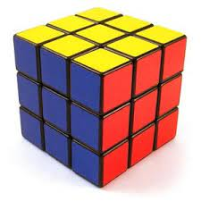
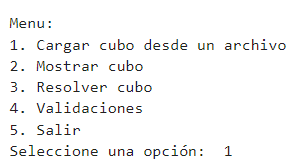

# Juego del "Cubo de Rubik"

## 👋 Reporte

- Autor: Alfred Brandon Garcia Arias
- Descripcion del proyecto: El Cubo Rubik es un rompecabezas cúbico que consta de piezas rotativas. El objetivo del
juego es conseguir que cada una de las seis caras del cubo esté compuesta por nueve
cuadrados del mismo color.

## 🐍 Requerimientos del entorno de programacion
Trabajamos con la siguiente versión del lenguaje Python, para evitar errores de compilación o paquetes faltantes:

[descargar la versión solicitada](https://www.python.org/downloads/release/python-3112/)

## 📜 Empezamos
Descarga o clona el proyecto:
1) en tu IDE de preferencia para lenguaje 'python' y ejecutalo.
2) el menu tiene la aplicado la interracion con el usuario, para ayudarle a cargar el cubo (e incluso se puede codificar cualquier estado), mostrar las validaciones si el cubo esta cargado correctamente, acciones que le podemos indicar para ir armando el cubo y al final mostrar el resultado con una visualizacion detallada del campo.

👀 NOTA: Algunas funciones estan incompletas sobre girar lados y caras en el sentido ya sea a la derecha o izquierda, se recomienda salir del menu (5.) y volver a empezar.

## 💻 Diseño e Implementacion 👨‍🏫 

- Para crear el cubo, primero establecimos la notación para las caras: F (Frontal), B (Trasera), U (Superior), D (Inferior), R (Derecha) y L (Izquierda). Luego, asignamos los colores del cubo: W (Blanco), Y (Amarillo), G (Verde), B (Negro), O (Naranja) y R (Rojo).

- En la clase CuboRubik, implementamos algoritmos para mostrar el cubo y girar cada cara en la dirección especificada. Luego, decidimos utilizar el algoritmo A* debido a su eficiencia y funcionalidad para este tipo de problema.

- Para definir una heurística, consideramos cuatro opciones: el número de fichas mal colocadas en una cara, la distancia Manhattan (que suma las distancias horizontales y verticales entre la posición actual y la posición correcta de cada ficha), la distancia de fichas mal colocadas (que suma las distancias entre la posición actual y la posición correcta de cada ficha), y la búsqueda de patrones o subpatrones específicos, como esquinas o aristas. Sin embargo, no logramos obtener la eficiencia deseada con este último enfoque.

- En resumen, creamos el cubo utilizando una notación clara y definimos diversas heurísticas para abordar el problema de resolver el cubo de Rubik, aunque encontramos desafíos en la implementación eficiente de algunas de ellas.

## 🤔 Trabajo futuro

1) Validación Mejorada: Implementar una validación más exhaustiva en el método validar_cubo, incluyendo la verificación de la orientación correcta de los centros y la cantidad exacta de cada color en el cubo.
2) Interfaz de Usuario: Desarrollar una interfaz de usuario gráfica (GUI) para interactuar con el cubo de Rubik. Esto podría hacer que la experiencia de uso sea más intuitiva y atractiva.
3) Resolver el Cubo: Crear un algoritmo para resolver automáticamente el cubo de Rubik. Esto podría ser una adición útil para aquellos que estén aprendiendo a resolver el cubo o que quieran ver cómo se resuelve paso a paso.
4) Persistencia de Datos: Implementar la capacidad de guardar y cargar el estado del cubo desde un archivo de datos en lugar de solo cargarlo desde un archivo de texto. Esto podría permitir una mejor organización de los datos y una experiencia más fluida para el usuario.
5) Mejoras en la Interacción: Agregar funcionalidades adicionales, como rotación interactiva del cubo en la GUI, animaciones al girar caras y lados, y la posibilidad de deshacer y rehacer movimientos.
6) Optimización del Código: Revisar el código existente para identificar áreas que puedan optimizarse en términos de rendimiento, legibilidad y mantenibilidad. Esto podría incluir la reestructuración del código en funciones más pequeñas y modulares, así como la eliminación de duplicación de código.
7) Documentación y Pruebas: Escribir documentación detallada para el proyecto, incluyendo explicaciones sobre cómo usar cada función y clase, así como ejemplos de código. Además, realizar pruebas exhaustivas para garantizar que todas las funcionalidades funcionen como se espera y manejar adecuadamente los casos límite y los errores.
8) Personalización del Cubo: Permitir que los usuarios personalicen la apariencia del cubo eligiendo sus propios colores y patrones.

👉 [Consulta el manual de instrucciones](https://rubikscu.be/#cubesolver) para más detalles sobre el juego.

---

❤️‍🔥 Disfruta el juego del "Cubo de Rubik"!
